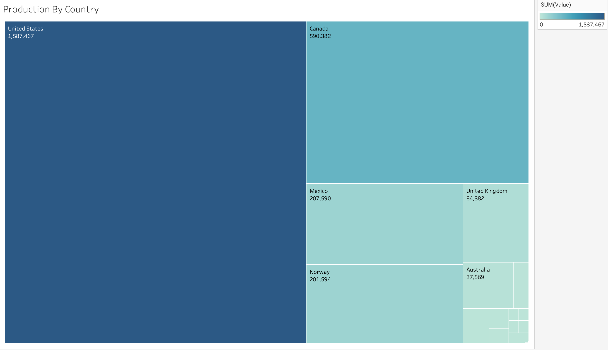
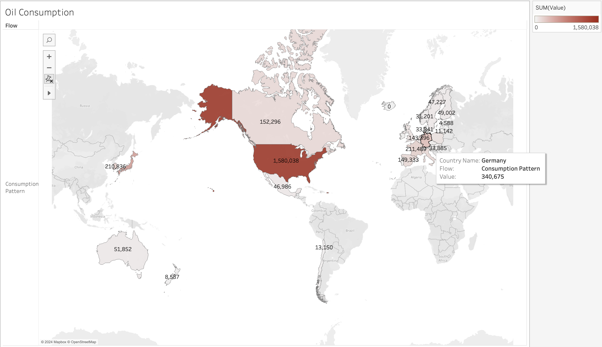
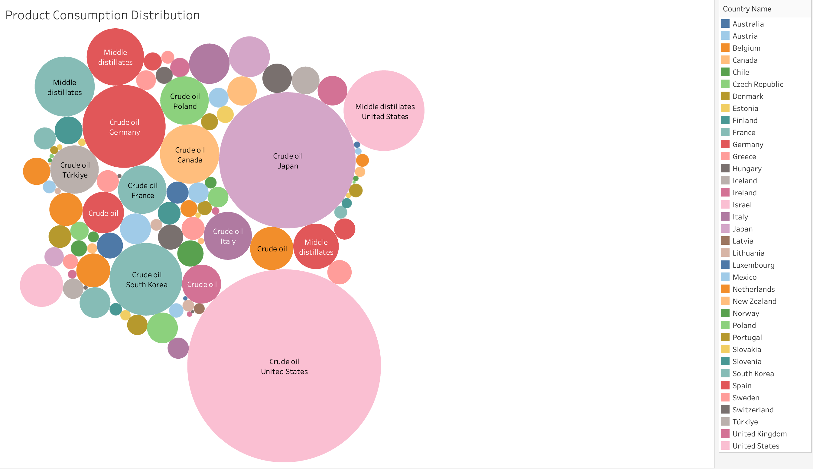
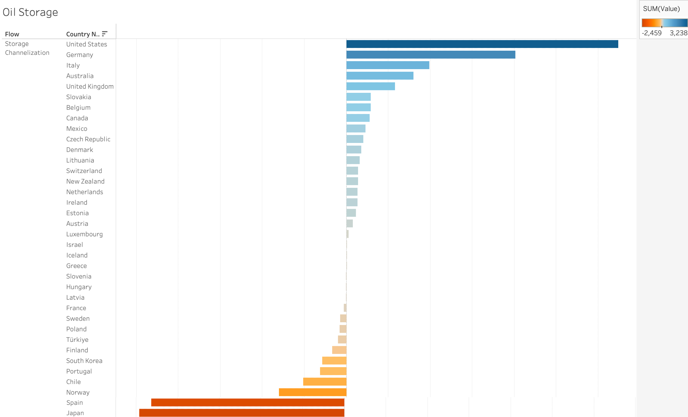
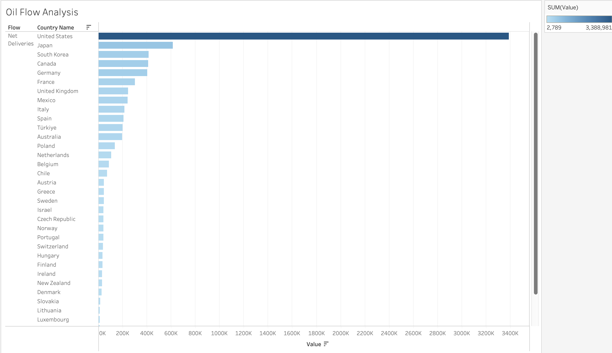

# VizOil: Data Analytics for Investment &amp; Export Strategies in The Oil &amp; Gas Industry

## Introduction

In a world that has unlimited needs but scarce resources, it is crucial to optimally distribute the energy resources such as Oil & Gas such that transportation cost can be minimized, carbon emission can be reduced and revenue generation can be maximized.

In this report, a dataset from Kaggle (Islam, 2024) will be used for the analysis. It contains information about the flow of oil (import, export, production, consumption, etc) across multiple countries from 2021-2023. More details about the dataset can be found at https://www.kaggle.com/datasets/sazidthe1/oil-production

The goal of the analysis is to solve the following business problems: What are the best investment & export strategies to promote stability for the Oil & Gas market around the world?

## Oil Production

The first task is to identify which country has the largest oil production

  

 

From the diagram above, it can be seen that the top three countries with the largest oil production are United States, Canada, and Norway. Unfortunately for this dataset, it only contains the production data of crude oil. However, it is also mandatory to observe how each country consume the oil & gas product for its need.

## Consumption Pattern

The first task that can be done is to discover the oil consumption behavior across multiple countries
 
### Country-Level

  

 

From the figure above, it can be seen that United States has an outstanding amount of consumption compared to other countries. Other than that, it can be seen that Japan and Germany also has significantly high amount of oil consumption. However, now the question is, which oil product do these countries consume?

### Product-Level

  

 

From the visualization above, it can be seen that there is a huge demand for crude oil, especially in the United States and Japan. Additionally, there are also some demands in Middle Distillates across multiple countries as well. While some countries have really high oil consumption, it is important to understand how they are managing the oil storage system.

## Oil Storage Analysis

  

 

Based on the graph above, it can be seen that Spain and Japan have significantly low oil storage. While on the other side, United States has high amount of oil storage. But now the question, how do countries like Japan can maintain high level of oil consumption despite having low oil production and storage? Additionally, how does United States manage to have high oil storage despite having oil consumption that is almost similar to its production level?

## Import – Export Analysis

  

 

From here we can see that United States has a really high importing value which explains why it is still able to maintain high level of oil storage. It is also observed that Japan also has high value of oil importing, which explains why it is still able to fulfill the high oil consumption needs despite having low level of oil production and storage.

## Suggestion

Based on the analysis above, there are several strategies that can be made:

- Investment Strategies:
    - **Storage Infrastructure Development**: invest funds to improve the oil storage system in countries like Japan and Spain which have low oil storage.
    - **Oil Refining & Processing Facilities**: invest funds to countries which have high crude oil demand like United States and Japan

- Exporting Strategies
    - **Strategic Partnership**: Secure long-term export contracts with oil import-dependent countries like United States and Japan.
    - **Diversification of Export Markets**: Offer different (refined) oil products to countries that have high demand for Crude Oil such as United States and Japan. This strategy is crucial to maximize revenue generation, to minimize risk of over-reliance on a single product, as well as to expand market ownership.

## Limitation

Take note that this project is only used for the purpose of data analysis project using Tableau. It may not be applicable to the real world as there are several factors that has not been taken into account, including:

- Government’s regulation for each country
- Environmental impacts (e.g. carbon emission)
- Production of other oil products
- The data does not contain any information regarding developing countries

## References

Islam, S. (2024, March 29). Oil production dataset. Kaggle.
  https://www.kaggle.com/datasets/sazidthe1/oil-production 
